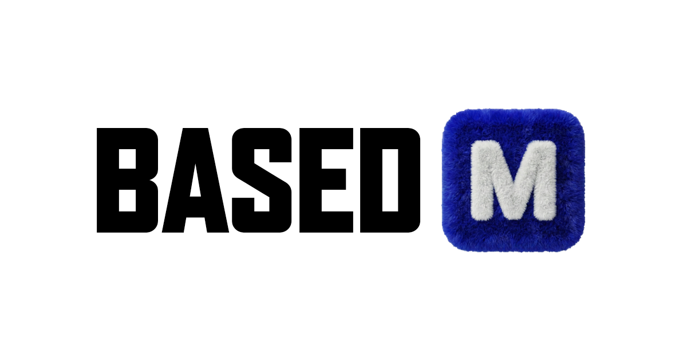

# Antigravity Meme Maker 🔵



A fully on-chain meme generator built on **Base**. Create memes, store them permanently on IPFS, and mint them as NFTs.

## Features

- **🎨 Canvas Editor**: Add text, stickers, drag-and-drop images, and draw freely.
- **💾 IPFS Storage**: Memes are automatically uploaded to decentralized storage (via Pinata).
- **🔗 Smart Contract Minting**: Mint your creation directly to the **Base** blockchain (`MemeNFT` contract).
- **🕸️ Shareable Links**: Generate instant links to share your meme with friends (`/share?id=<CID>`).
- **🔵 Share to Base**: One-click sharing to **Warpcast** (Farcaster) with embedded deep links.
- **📱 Wallet Connect**: Integrated with **RainbowKit** and **Wagmi** for seamless wallet connection.

## Tech Stack

- **Frontend**: React, Vite, TypeScript, TailwindCSS, Shadcn/UI
- **Web3**: Wagmi, Viem, RainbowKit, Ethers.js
- **Storage**: Pinata (IPFS)
- **Smart Contract**: Solidity, Hardhat, Base Mainnet/Sepolia

## Prerequisites

1.  **Node.js** (v18+)
2.  **Pinata Account**: Get your API keys at [pinata.cloud](https://pinata.cloud).
3.  **Wallet**: Coinbase Wallet, MetaMask, or any EVM wallet.
4.  **Base ETH**: You need a small amount of ETH on Base Mainnet (or Sepolia for testing) for gas.

## Setup

1.  **Clone the repository:**
    ```bash
    git clone https://github.com/your-repo/based-meme-maker.git
    cd based-meme-maker
    ```

2.  **Install dependencies:**
    ```bash
    npm install
    ```

3.  **Configure Environment:**
    Create a `.env` file in the root directory:
    ```env
    VITE_PINATA_API_KEY=your_pinata_api_key
    VITE_PINATA_SECRET_KEY=your_pinata_secret_key
    PRIVATE_KEY=your_wallet_private_key_for_deployment
    ```

4.  **Run Locally:**
    ```bash
    npm run dev
    ```
    Open [http://localhost:8080](http://localhost:8080) to view it in the browser.

## Deployment

### Smart Contract

This project uses a standalone deployment script for Base.

1.  Ensure your `.env` has a `PRIVATE_KEY` with gas funds.
2.  Run the deploy script:
    ```bash
    node scripts/deploy-standalone.cjs
    ```
    This will deploy the contract and automatically update `src/constants/contract.ts` with the new address and ABI.

### Frontend

Build the application for production:

```bash
npm run build
```

Upload the `dist` folder to Vercel, Netlify, or your preferred host.

## Smart Contract

The `MemeNFT` contract is an ERC721URIStorage token.
- **Current Address (Base Mainnet)**: `0xB96cBBED214C9AB06F3Cd25dA0638D4bcA6E5D40`

---

*Made with 💙 by Antigravity on Base*
